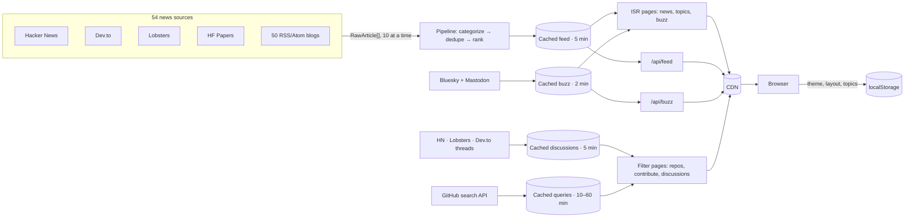

# DevPulse

[](https://github.com/Masad791/devpulse/actions/workflows/ci.yml)
[](LICENSE)

Open-source tech news for builders: **AI & ML, system design, DevOps, cloud, web, data, security, languages, mobile, open source and career**, plus what engineers are saying on Bluesky and Mastodon, trending GitHub repos, and issues you can contribute to. Built entirely on free public APIs.

## Features

- **12 topics** from 54 sources: Hacker News, Dev.to, Lobsters, Hugging Face Papers and 50 engineering blogs (Netflix, Meta, Stripe, Cloudflare, ByteByteGo, AWS, Kubernetes, Rust, Go, Krebs, Martin Fowler…).
- **Buzz**: posts from 20 well-known engineers on Bluesky + trending tech posts on Mastodon, updated live (checks every minute, "N new posts" like Twitter).
- **Repos**: trending GitHub repos by category — Claude & agent skills, AI agents, MCP servers, LLM apps, self-hosted & free alternatives, dev tools, DevOps, web, learning lists — new this week/month or popular & active, filterable by language.
- **Contribute**: open issues labelled good first issue, help wanted, hacktoberfest, documentation… by language, keyword or repo. Every trending repo links to its contributor-friendly issues.
- **Discussions**: the most-commented threads right now from Hacker News, Ask HN, Lobsters and Dev.to #discuss.
- **Make it yours**: 9 themes (Dracula, Nord, Midnight, Solarized, Terminal…), any accent color, list or card layout, compact mode, sans or mono font, and a personal **For you** feed — no account, saved in your browser.
- Ranked, paginated feed; trending AI models and rising repos in the sidebar; live source health; a **free JSON API** with open CORS.

## How it works



- **Adapters** (`src/lib/sources/`) turn each upstream API into one `RawArticle` shape. They run through a concurrency pool (10 in flight) so a deploy doesn't stampede 50 APIs at once; a failing source shows red in the sidebar and never breaks the page.
- **Pipeline** (`src/lib/pipeline.ts`) is pure and unit-tested: link sanitizing, keyword topics, URL-normalized dedupe, and ranking = per-source popularity percentile × 24h half-life × same-source penalty.
- **Caching**: the processed feed is one cache entry shared by every page and the API. News, topic and Buzz pages are ISR (static, rebuilt in the background); the filter pages (Repos, Contribute, Discussions) render per request but read from cached data and cached GitHub queries. API responses carry `s-maxage`, so repeat traffic hits the CDN, not the upstream APIs.
- **"Real-time"**: open pages re-fetch their (cached) server render every 5 minutes; Buzz polls every minute. True push would need the sources to push — free APIs don't.
- **Themes** are CSS variables per `data-theme`; layout/density are Tailwind custom variants (`cards:`, `compact:`). An inline script applies saved prefs before first paint, so static pages stay static with no theme flash.
- **Trending repos**: GitHub has no trending API, so "new this week/month" = repos created in that window ranked by stars, and "popular & active" = most-starred repos pushed this week.

## Public API

```
GET /api/feed?topic=ai,devops&page=1&limit=30
GET /api/buzz
```

`topic`: comma-separated, any of `ai system-design devops cloud web data security languages mobile open-source career engineering` (omit for all). `page`: 1–10. `limit`: 1–100.

## Run locally

Requires Node.js 20.9+.

```bash
npm install
npm run dev        # http://localhost:3000
npm test
```

Optional: copy `.env.example` to `.env.local` and set `GITHUB_TOKEN`.

## Deploy

Vercel and Netlify both detect Next.js automatically — import the repo and deploy, no config needed.

For production, set **`GITHUB_TOKEN`** in the project's environment variables: a [fine-grained token](https://github.com/settings/personal-access-tokens) with "Public repositories (read-only)" access. Without it, GitHub search allows only 10 requests/min, which the Repos and Contribute pages will hit under real traffic.

Want your own copy? These buttons fork this repo into your account and deploy it:

[](https://vercel.com/new/clone?repository-url=https://github.com/Masad791/devpulse&env=GITHUB_TOKEN&envDescription=Optional%20read-only%20GitHub%20token%20for%20higher%20search%20rate%20limits)
[](https://app.netlify.com/start/deploy?repository=https://github.com/Masad791/devpulse)

## Contributing

Adding a feed, an engineer, a repo category, a keyword or a theme is usually one line — see [CONTRIBUTING.md](CONTRIBUTING.md). Security reports: see [SECURITY.md](SECURITY.md).

## Stack

Next.js 16 (App Router, ISR) · TypeScript · Tailwind CSS 4 · Vitest · GitHub Actions · Vercel / Netlify. MIT licensed.
